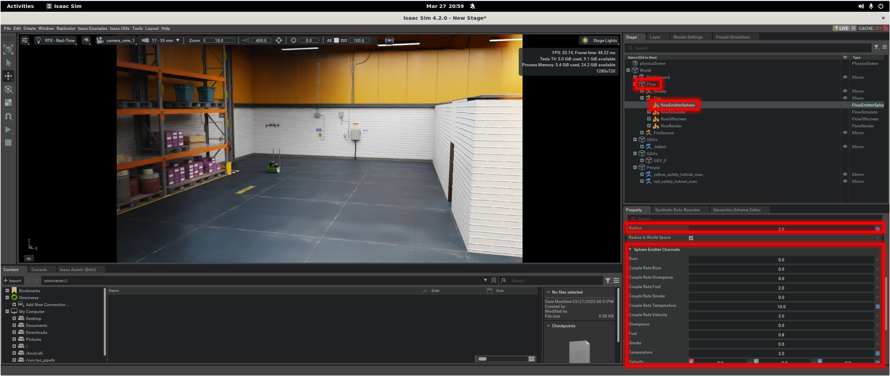
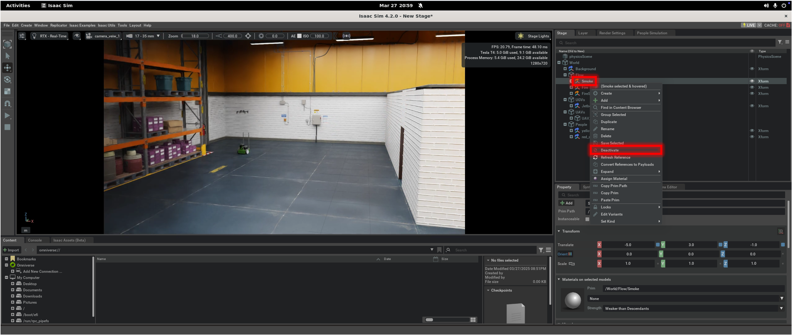
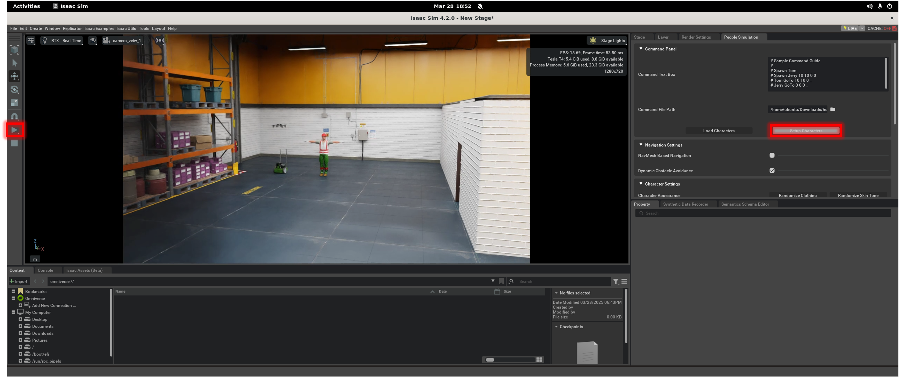

# isaac-hrc
Human-Robot Collaboration in Isaac Sim

## Installation
```bash
#------ Installation of Isaac Sim ------#
mkdir ~/isaacsim 
cd ~/Downloads 

# Download the Isaac Sim zip file (see: https://docs.isaacsim.omniverse.nvidia.com/latest/installation/download.html)
wget https://download.isaacsim.omniverse.nvidia.com/isaac-sim-standalone%404.2.0-rc.18%2Brelease.16044.3b2ed111.gl.linux-x86_64.release.zip

# Extract the downloaded zip file into the 'isaacsim' folder (see: https://docs.isaacsim.omniverse.nvidia.com/latest/installation/install_workstation.html)
unzip "isaac-sim-standalone@4.2.0-rc.18+release.16044.3b2ed111.gl.linux-x86_64.release.zip" -d ~/isaacsim 

#------ Cloning the GitHub Repo ------#
# Navigate into Isaac Sim's 'examples' extension directory
cd ~/isaacsim/exts/omni.isaac.examples/omni/isaac/examples/

# Remove existing 'user_examples' if present to prevent conflicts
rm -rf user_examples/

# Clone 'isaac-hrc' repo into the 'examples' directory
git clone https://github.com/fdcl-gwu/isaac-hrc.git

# Move the cloned 'user_examples' folder out of 'isaac-hrc' into the current 'examples' directory
mv ./isaac-hrc/user_examples/ ./user_examples

# Move the cloned 'human_cmd.txt' into the 'Downloads' folder
mv ./user_examples/human_cmd.txt ~/Downloads

#------ Running Isaac Sim ------#
cd ~/isaacsim
./isaac-sim.sh
```

## Enable `omni.anim.people`, `omni.flowusd`, and `omni.usd.schema` Extensions
1. Open the **Extension Manager** from the menu bar: **Window > Extensions**. 


2. In the **Extension Manager**, search for "people" and enable/autoload the `omni.anim.people` extension ([ref](https://docs.omniverse.nvidia.com/isaacsim/latest/features/warehouse_logistics/ext_omni_anim_people.html)).


3. Similarly, search for "flow" and enable/autoload the `omni.flowusd`, `omni.flowusd.bundle`, `omni.flowusd.ui`, and `omni.usd.schema` extensions ([ref](docs/Fluid_Dynamics.md)).


4. Load the **People Simulation** UI from **Window > People Simulation**.


## Open the *HRC Warehouse* example
1. Go to the top menu bar and click **Isaac Examples > HRC Warehouse**.


2. Click **Open Source Code** to edit the scripts in Visual Studio Code.
- The `human_robot_collaboration.py` script is where the application's logic is addedand the application's UI elements are added in `human_robot_collaboration_extension.py` script and thus linked to the logic.


3. Click the **LOAD** button to load the World.


4. If needed, add objects to the scene through `Isaac Assets(Beta)`.


> Important: After modifying the scripts, press `Ctrl+S` for hot-reload, and then create a new empty stage via **File > New From Stage Template > Empty** and click **Don’t Save**.


## Basic Usage of `omni.flowusd` Extension
1. Configure properties (e.g., size and smoke) of flow objects in `flowEmitterSphere`.


2. In case you need to turn on or off the flow object, toggle this activate/deactivate button:



## Basic Usage of `omni.anim.people` Extension
1. In the **People Simulation** UI, click **Command File Path** and set the path to `~/Downloads/human_cmd.txt`.


2. Click the **Load Characters** button to load the characters assets and animations, and then click **Setup Characters** button. Also, turn off the **Navmesh Based Navigation** setting.


3. Start simulation by clicking **Play** and click **Setup Characters** button again when you want to run a people simulation.


> Tips: How to Create a Camera?
1. Select the character’s `SkelRoot` by holding down control and clicking on `SkelRoot`. Here, click `Create` button and add `Camera`.


2. If needed, Rename the camera such as `human_camera`.


3. With `human_camera` view, modify `Translate` and `Orient` to position the camera at the character’s head, facing forward.
