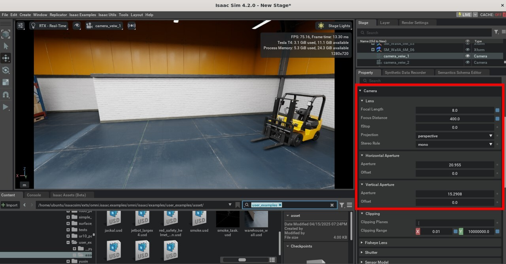

# Deriving Camera Intrinsic Parameters from Physical Properties

## Background
In the pinhole camera model, the camera's intrinsic matrix includes focal lengths $f_x$ and $f_y$, which are typically given in pixel units. These define the scaling from 3D world coordinates to 2D image coordinates. To compute these from physical units, we must convert the focal length from millimeters (mm) to pixels using the sensor size and image resolution.

## Given Parameters
- Focal length: $f = 8.0 \, \text{mm}$
- Sensor width: $W_{mm} = 20.955 \, \text{mm}$
- Sensor height: $H_{mm} = 15.291 \, \text{mm}$
- Image resolution: $W_{px} = 1200 \, \text{pixels}$, $H_{px} = 680 \, \text{pixels}$

## Step-by-Step Explanation

### 1. Compute Pixel Density
To convert millimeters to pixels, we need to know how many pixels exist per millimeter on the sensor:

$$
\text{Pixel density (x-direction)} = \frac{W_{px}}{W_{mm}} = \frac{1200}{20.955} \approx 57.27 \, \text{pixels/mm}
$$

This means there are approximately 57.27 pixels for every millimeter along the width of the sensor.

### 2. Convert Focal Length to Pixels
Now, we compute the focal length in pixel units by multiplying the focal length in millimeters by the pixel density:

$$
f_x = f \cdot \frac{W_{px}}{W_{mm}} = 8.0 \cdot \frac{1200}{20.955} \approx 458.7 \, \text{pixels}
$$

$$
f_y = f \cdot \frac{H_{px}}{H_{mm}} = 8.0 \cdot \frac{680}{15.291} \approx 356.1 \, \text{pixels}
$$

## Conclusion
These values of $f_x$ and $f_y$ are used to construct the camera's intrinsic matrix $K$:

$$
K = \begin{bmatrix}
f_x & 0 & c_x \\
0 & f_y & c_y \\
0 & 0 & 1
\end{bmatrix}
$$

where $(c_x, c_y) = (600, 340)$ for a $1200 \times 680$ image.
